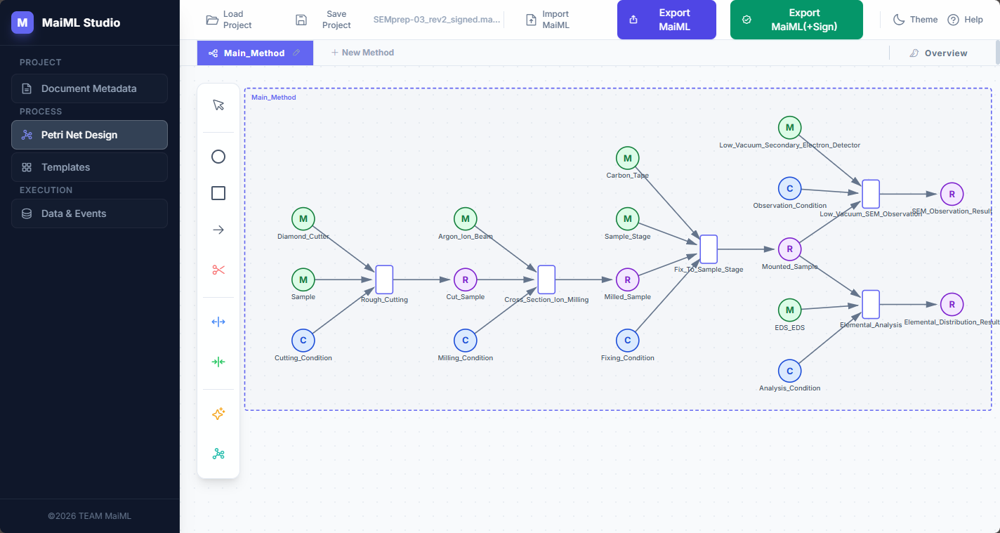
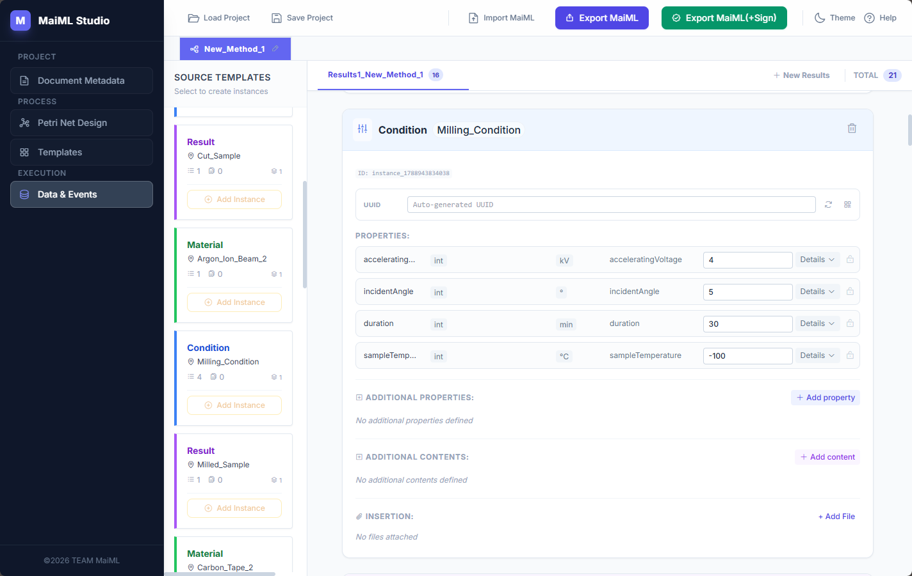

# MaiML Studio

**MaiML Studio** is a web app for visually designing and exporting files that conform to [MaiML (Measurement Analysis Instrument Markup Language)](http://www.maiml.org/).

It runs simply by opening the HTML file in Chrome / Edge — no additional installation is required.

<p align="center">
  <a href="docs/screenshot_design.png">
    <picture>
      <source media="(prefers-color-scheme: dark)" srcset="docs/screenshot_design_dark.png">
      
    </picture>
  </a>
</p>

---

## Features

- **No installation required** — just double-click the `.html` file to launch
- **Runs entirely in the browser** — works on Windows / Mac / Linux with Chrome / Edge (latest version)
- **Multi-method support** — edit multiple experiment/analysis methods together on a unified canvas where each method is arranged as a vertically stacked lane
- **Project save/restore** — save and load in JSON format
- **MaiML import** — load an exported `.maiml` / `.xml` file and restore it to an editable state
- **MaiML export** — generate and download an XML file conforming to the MaiML standard
- **Dark/light mode** — automatically follows the OS setting as the initial value
- **Excel import feature** — bulk-load definitions from an Excel file
- **AI Petri net generation** — automatically generate Places / Transitions / Arcs / Templates from experimental procedure text (cloud Gemini API or local Ollama)
- **XML encryption feature** — protect confidential data with AES-256-GCM
- **XML digital signature feature** — output tamper-detectable MaiML files with RSA-SHA256 (W3C XML Signature compliant)
- **File linking feature** — hash-based linking between multiple MaiML files (`<chain>` / `<parent>`)

---

## How to Use

1. Download `MaiMLStudio.html`
2. Open it in Chrome or Edge
3. Edit each tab in turn to design your MaiML file
4. Use the **Export MaiML** button in the header to output a `.maiml` file

---

## Screen Layout

### 🗂 Document Metadata Tab

Edit the metadata for the entire MaiML file.

| Section | Content |
|-----------|------|
| **General Information** | Set the Document ID, UUID, Document Name, and Description |
| **Namespaces** | Register the namespace prefix and URI used for Property / Content keys. Registered prefixes appear as autocomplete suggestions when entering a Key |
| **Global Properties** | Add and edit properties (Key / Type / Value / Description) applied to the entire file, in a hierarchical structure. Supports nested structures via `propertyListType` |
| **Vendors** | Register manufacturer information for the instruments used |
| **Instruments** | Register the analytical instruments used |
| **Owners** | Register data owners |
| **Creators** | Register data creators. Can be linked to registered Vendors/Instruments |

- Key fields include input validation conforming to the QName format (`[a-zA-Z_][a-zA-Z0-9_.-]*` or `prefix:localName`)
- If a prohibited character is entered, the field is highlighted with a red warning border

---

### 🔷 Petri Net Design Tab

Design the experiment/analysis process as a Petri net. All methods are arranged vertically as **lanes** separated by dotted lines, on a **unified canvas** where you can edit multiple methods on a single screen by scrolling.

**Node Operations**

| Operation | Method |
|------|------|
| Add a Place (circle) | Select the Place button on the toolbar, then click the canvas (added to the lane you clicked) |
| Add a Transition (rectangle) | Select the Transition button on the toolbar, then click the canvas (added to the lane you clicked) |
| Connect an Arc (arrow) | Select the Arc button on the toolbar, then drag from the start node to the end node (within the same lane only) |
| Connect a TemplateRef (blue dashed line) | Select the TemplateRef button, then drag from a Place to a Place (can connect across lanes) |
| Connect an InstanceRef (green dashed line) | Select the InstanceRef button, then drag from a Place to a Place (can connect across lanes) |
| Move a node | In Select mode, drag the node (can only be moved within the same lane) |
| Delete a node | In Select mode, click the node → Delete Node in the right panel |
| Auto Layout | Use the Dagre icon on the toolbar to auto-arrange only the Places/Transitions of the currently selected method (the canvas view position does not change) |
| Pan the canvas | Drag the canvas background |
| Zoom | Mouse wheel |

**Unified Canvas (Lanes)**

- Each method is displayed as a **lane** with a dotted border, stacked vertically; adding/moving Places, Transitions, and Arcs is restricted to within a lane
- **Only TemplateRef / InstanceRef** can cross lane boundaries to connect directly to a Place in another method
- Drag the dotted line at the bottom of a lane to manually adjust its height (it also expands automatically as nodes are placed)
- Clicking a method tab scrolls to the corresponding lane and puts it into a selected state (highlighted border)
- Loading a project created with an older version (which used Proxy Places) automatically converts it to direct cross-lane references

**Multiple Methods**

Adding a method via `+ New Method` in the tab bar adds a new lane. The **🐦 Overview** tab at the right end of the tab bar shows a bird's-eye view of all methods (read-only).

Method names must be unique within a project, so you cannot create a method with the same name as an existing one. New methods are given a default name with an auto-incremented number that does not collide with existing names.

#### ✨ AI Petri Net Generation (AI Petri Net Generator)

The **✨** button on the toolbar opens the "AI Petri Net Generator" modal. Enter your experimental procedure as text and it generates Places / Transitions / Arcs / Templates and adds them to the canvas.

**① Choose an LLM provider**

| Provider | Description |
|------|------|
| **☁️ Cloud (Gemini)** | Enter a Gemini API key obtained from Google AI Studio and pick a model. The API key is stored in the browser's localStorage and is sent nowhere except the Google Gemini API. Accurate and fast (a few seconds), but your data is sent to Google's servers |
| **🖥️ Local (Ollama)** | Uses a local Ollama instance. Since no data leaves the machine, this suits confidential experimental data and works without a network connection. Processing time depends on your PC (especially the GPU); on a machine without a GPU it can take several to a dozen-plus minutes |

**② Enter the procedure text**

Free-form text works, but the following recommended structure improves accuracy.

```
[STEP] Step name (action verb phrase)
[IN:material] Raw substance, reagent, or instrument name (no quantities)
[IN:condition] Condition name | param:value unit, param:value unit
[IN:result] Output of a previous STEP (reuse the name verbatim)
[OUT:condition] Intermediate state name | param:value unit
[OUT:result] Final product or measurement result name
```

Using the same label in multiple STEPs automatically treats it as a shared Place (connected by arcs).

**③ Options and execution**

- **Generate Templates** (ON by default) - also generates the properties (with types and units) of the template for each Place
- **Generate** - runs the generation. An elapsed-time counter is shown while it works
- **Preview** - review the list of generated Places / Transitions / Arcs / Templates
- **Apply to Canvas** - adds the generated result to the canvas. Dagre Auto Layout is applied automatically afterwards

**Setting up Ollama** (when using local mode)

1. Download and run the installer from [https://ollama.com](https://ollama.com)
2. Pull a model (e.g. `ollama pull gemma4:e4b`)
3. Start Ollama; it is ready once its icon appears in the notification area
4. In the AI Generate modal, choose **🖥️ Local (Ollama)** and click **Fetch Models** to list the available models

If you see "Connection failed", quit Ollama, run the following in PowerShell, and restart it (CORS setting).

```powershell
[System.Environment]::SetEnvironmentVariable("OLLAMA_ORIGINS", "*", "User")
```

---

### 📋 Templates Tab

A card is displayed for each Place defined in Petri Net Design, and the buttons at the top-right of each card let you add/edit the data templates (schemas) associated with that Place.

- **+ Add material** — add a template for sample data
- **+ Add condition** — add a template for condition/parameter data
- **+ Add result** — add a template for result/output data

Each template can have `property` (single value) and `content` (list value) added to it, and also supports nested structures via `propertyListType`. Templates inherited from another method's template (via TemplateRef) are displayed as read-only.

#### 📊 Excel Import Feature

Instead of manual entry, you can bulk-load definitions from an Excel file. The target Excel file must have a sheet name matching the Place. **You can express a nested structure in the Key column using the `>` symbol.**

Ten columns are recognized: `Element` / `Key` / `Type` / `Units` / `Description` / `Value` / `Size` / `Axis` / `ScaleFactor` / `FormatString` (the last four are for `content` rows).

| Element | Key | Type | Units | Description | Value | Size | Axis | ScaleFactor | FormatString |
|---------|-----|------|-------|-------------|-------|------|------|-------------|--------------|
| property | Temperature | propertyListType | | Temperature setting | | | | | |
| property | >Set_Temp | doubleType | °C | Set temperature | 180 | | | | |
| property | >Control | propertyListType | | Control parameters | | | | | |
| property | >>PID_P | doubleType | | P value | 1.2 | | | | |
| content | >>Time_Log | contentDoubleListType | s | Time log | 0 10 20 | 3 | t | 1 | 0.00 |
| property | Operator | stringType | | Operator | Tanaka | | | | |

**Nesting rules:** `>` = 1 level, `>>` = 2 levels. The parent element must always be `propertyListType`.

**Ordering rule:** within each nesting level, list `property` rows first and `content` rows afterwards. The same order applies at the root level and inside every nested child group. Once you return to a parent level, you can start with `property` again.

---

### 📊 Data & Events Tab

<p align="center">
  <a href="docs/screenshot.png">
    <picture>
      <source media="(prefers-color-scheme: dark)" srcset="docs/screenshot_dark.png">
      
    </picture>
  </a>
</p>


Enter the actual measurement data and events, based on the schemas defined in Templates.

**Left Panel (Source Templates)**

- **Data Templates** — a list of registered templates. The **+ Add Instance** button at the bottom of each card generates an instance
- **Transitions (Events)** — the transitions defined in the Petri net (one per method). The following fields can be edited in each transition card.

**Transition (eventLog) Card Fields**

| Field | Description |
|-----------|------|
| **lifecycle** | Select the lifecycle state of the event (`started` / `completed`, etc.) |
| **timestamp** | Enter the date/time in ISO 8601 format (`YYYY-MM-DDThh:mm:ss.sssTZD`). If left blank, the current time is automatically set at export |
| **UUID** | The UUID of the event. Enter manually or generate automatically with a button click |
| **creatorRef** | Reference a Creator already registered in Document Metadata's **Creators**, via a dropdown |
| **ownerRef** | Reference an Owner already registered in Document Metadata's **Owners**, via a dropdown |

`creatorRef` / `ownerRef` are optional fields. When selected, they are output as `<creatorRef>` / `<ownerRef>` elements within the exported MaiML's `<eventLog>`.

**Right Panel (Results Groups / Instance List)**

The generated instances and events are displayed as a list. The following operations are available on each instance card.

- Directly edit the values of Property / Content inherited from the template
- Add instance-specific Property / Content
- Add insertion information (URI, UUID, Hash) for external files (measurement data, etc.)

**Results Groups**

The tab bar at the top of the Data & Events tab lets you manage instances and events by dividing them into multiple groups.

Each tab corresponds to one `<results>` element in MaiML. Events belong to the active tab and are recorded as `<resultsRef ref="tab name"/>` on export.

| Operation | Method |
|------|------|
| Add a group | Click the **`+ Add Results`** button at the right end of the tab bar |
| Rename a group | Click the pencil icon on the tab |
| Delete a group | Click the `×` button on the tab (also deletes the instances/events within the group). The last remaining tab cannot be deleted |
| Switch groups | Click the tab |

Each method has its own independent Results Groups. When you switch groups, the content displayed in the right panel switches to match the group.

⚠️ **Tab name constraints:** the tab name is used as the ID attribute value of `<results id="...">` on export. Since IDs must be unique within the file, the following rules apply (the input dialog validates them in real time).

- Allowed characters are letters, digits, `_`, `-`, and `.`
- Must start with a letter or `_` (not a digit or symbol)
- Cannot duplicate another tab's name
- Reserved names (`document` / `protocol` / `data` / `eventLog`) cannot be used

---

## File Operations

| Operation | Description |
|------|------|
| **Save Project (JSON)** | Save the current editing state as a JSON file (can be re-edited later) |
| **Load Project (JSON)** | Load a saved JSON file and restore the state |
| **Import MaiML** | Load an exported `.maiml` / `.xml` file and restore it to an editable state (see the next section for details) |
| **Export MaiML** | Generate and download a `.maiml` XML file conforming to the MaiML standard |
| **Export MaiML(+Sign)** | Generate and download a `.maiml` file with an RSA-SHA256 XML digital signature |

---

## 📥 MaiML Import Feature (Import MaiML)

Loads an exported `.maiml` / `.xml` file and restores it to an editable state. In addition to files exported by Studio, MaiML files produced by other tools (single-method ones) can also be loaded.

Because MaiML files carry no Petri net coordinates, the placement of Places and Transitions is reconstructed by automatic layout on import.

| Item | Content |
|------|------|
| **Supported scope** | Only MaiML files containing a single method (one `<method>`) are supported. Files containing multiple methods are not currently supported (an error is displayed on import) |
| **Template collection** | Templates located under any of the `protocol` / `method` / `program` hierarchy levels are collected |
| **Encrypted data** | If `<xenc:EncryptedData>` is detected, a password prompt is shown and all such elements are decrypted at once (up to 3 retries; the entire import is aborted on failure) |
| **Warning for unsupported structures** | If a structure with types other than `propertyListType` having child property/content elements is detected (valid per the schema but unsupported by Studio), a confirmation modal listing the affected items is shown, letting you choose to continue (discarding the affected child elements) or cancel |
| **Automatic revision history registration** | On successful import, the source file is automatically registered as `<parent key="revised">` (an automatic process with no confirmation, based on the operating rule that "import = revise"). If the source file already had a `<parent>`, that information is preserved nested as a child of the new parent, maintaining the chain of revisions |
| **Handling of signatures** | If the source file had a `<ds:Signature>`, it is discarded (since re-editing invalidates the signature; a warning is shown) |

### Import Steps

1. Click the **Import MaiML** button in the header and select a `.maiml` / `.xml` file
2. If there is content currently being edited, a confirmation dialog asks whether it is okay to discard the current content
3. If there is encrypted data, a password input dialog is displayed
4. If an unsupported nested structure is detected, review the content and choose whether to continue or cancel
5. Once the import is complete, the content is restored across the Document Metadata, Petri Net Design, Templates, and Data & Events tabs

> **Note:** Directly overwriting the source file is not the intended workflow. The assumption is that you "save under a new name and trace the chain via revision history (`<parent>`)."

---

## 🔒 XML Encryption Feature (Section 6)

An XML encryption feature conforming to the MaiML standard (JIS K0200). `property` elements and `content` elements can be selectively protected.

| Item | Description |
|------|------|
| **Encryption algorithm** | AES-256-GCM (authenticated encryption with built-in tamper detection) |
| **Key derivation** | PBKDF2-SHA256 (100,000 iterations) |
| **Encryption method** | Content encryption (Type=#Content) — the parent element's tag and attributes are left as-is; only the child elements are encrypted |
| **Compliant specifications** | W3C XML Encryption 1.1 / JIS K0200 |

### Encryption Steps

1. On the **Templates tab** or **Data tab**, click the lock icon at the right end of the property/content row you want to encrypt
2. When the icon turns 🔐 (amber), it is marked as an "encryption target"
3. Click the **Export MaiML** button as usual
4. An encryption password setup dialog is displayed. Enter a password of 4 or more characters twice
5. In the exported MaiML file, the child elements of the target elements are replaced with `<xenc:EncryptedData>`

⚠️ **Note:** If you forget the password, decryption is not possible. Store it in a safe place.

---

## 🔗 File Linking Feature `<chain>` (Section 7)

A file linking feature using the `<chain>` element of the MaiML standard (JIS K0200). It links multiple MaiML files together and enables tamper detection (integrity verification via hash values). Like a blockchain, it can record a chronological chain indicating "this file inherits the content of another file."

| Item | Description |
|------|------|
| **Hash method** | SHA-256 (`<ds:DigestValue>` for signed files; the byte sequence of the entire file for unsigned files) |
| **Output location** | Immediately after the `<date>` element within the `<document>` element |
| **key attribute** | The default value is `key="chain"` |

### Registration Steps

1. Show the **Chained Files** section at the bottom of the **Document Metadata** tab
2. Click the **Add Chain** button and select the `.maiml` file to link to
3. The `//document/uuid` value and SHA-256 hash value of the selected file are automatically retrieved and displayed
4. Click the **Export MaiML** button as usual, and the `<chain>` element is written to the MaiML file

### Example Output XML

```xml
<document id="...">
  ...
  <date>2025-06-01T10:00:00+09:00</date>
  <chain id="chain_001" key="chain">
    <uuid>0bce8354-55f1-4047-b221-988e00c87c79</uuid>
    <hash method="SHA-256">B1sDhiK3...</hash>
  </chain>
</document>
```

---

## 🔗 Parent File Linking Feature `<parent>` (Section 7)

A registration feature for the revision-source file using the `<parent>` element of the MaiML standard (JIS K0200). It records that a given MaiML file is a revision/derivative of another MaiML file, and enables tamper detection via hash values.

| Item | Description |
|------|------|
| **Hash method** | SHA-256 (DigestValue for signed files; the entire file for unsigned files) |
| **key attribute** | Fixed value `key="revised"` |
| **Registration limit** | Only one entry (one revision source per file) |

### Registration Steps

1. Show the **Parent File** section at the bottom of the **Document Metadata** tab
2. Click the **Set Parent** button and select the revision-source `.maiml` file
3. The `//document/uuid` value and SHA-256 hash value of the selected file are automatically retrieved and displayed
4. Click the **Export MaiML** button as usual, and the `<parent>` element is written to the MaiML file

> **Note:** When a file is loaded using the **Import MaiML** feature, the source file is automatically registered as this `<parent>` (no manual **Set Parent** action is needed). The manual registration described here is for when you want to explicitly specify a revision source without using import.

---

## ✍️ XML Digital Signature Feature (Export MaiML(+Sign))

An XML digital signature feature conforming to the MaiML standard (JIS K0200). A MaiML file output via the **Export MaiML(+Sign)** button has a signature embedded that conforms to the W3C XML Signature specification, enabling detection of file tampering.

| Item | Description |
|------|------|
| **Signature algorithm** | RSA-SHA256 (`xmldsig-more#rsa-sha256`), 2048-bit key |
| **Signature method** | Enveloped Signature (the signature element is embedded within the file) |
| **Canonicalization** | Canonical XML 1.0 inclusive (`REC-xml-c14n-20010315`, without comments) |
| **Transforms** | `enveloped-signature` → `c14n` |
| **Reference** | `URI=""` (the whole document) |
| **Key info** | `<ds:KeyValue><ds:RSAKeyValue>` (Modulus / Exponent) inside `<ds:KeyInfo>` |
| **Position of the signature element** | The first child of `<document>` (JIS K 0200 6.2.2) |
| **Key management** | A new key pair is generated for each signing operation (the public key is embedded within the signature) |
| **Compliant specifications** | W3C XML Signature (XMLDSig Core) / JIS K0200 |

These six items — algorithm, canonicalization, transforms, reference, key info, and signature
position — are fixed as the **MaiML signature profile**. Interoperability with other
implementations, such as .NET `SignedXml`, has been confirmed by testing.

### Usage Steps

1. Click the **Export MaiML(+Sign)** button (green) in the header
2. The `.maiml` file is generated and downloaded, just as with the regular **Export MaiML**
3. The `<ds:Signature>` element in the output file contains the signature value and public key

> **Note:** A new key pair is generated each time you export. If you need to verify the signature, use the public key (`<ds:KeyValue>`) contained in the output file.

> ⚠️ **What this signature does and does not guarantee:** the public key used for verification is bundled inside the file itself. This feature therefore confirms **integrity** only — that the file has not been changed since it was signed. Anyone who rewrites the content can re-sign it with their own key, so it **does not guarantee the signer's authenticity** ("who signed it"), because there is no certificate/PKI to serve as a root of trust. Treat it as a convenient way to work with the MaiML signature structure.
